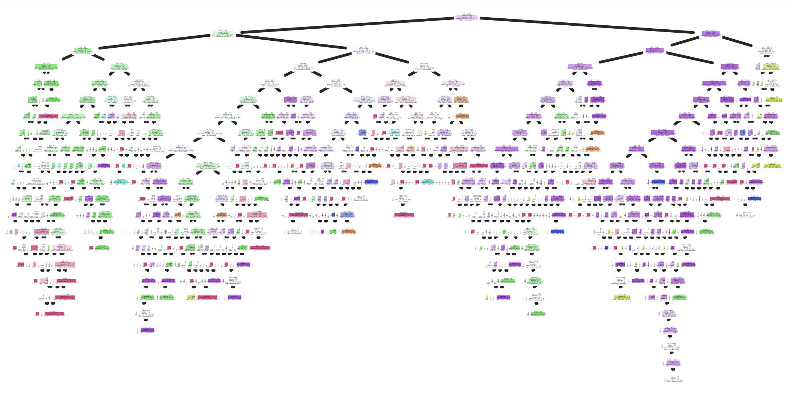

# Power Outage Data Analysis Project
### How does location and other data factors correlate to different power outage characteristics?
**Irving Ding**

This is a Data Science project based on analyzing power outage data from "Data on major power outage events in the continental U.S" by Mukherjee et. al. 

# Introduction
This project analyzes a datset of major power outages that occured in the United States from 2000-2016, defined as any power outage affecting more than 50,000 customers or losing more than 300 MW. Power outages affect many, and have far reaching consequences both in everyday life, industry, and economy. This dataset provides insight into how outages occur, how often, where, why, and more. In particular, this analysis hopes to elucidate connections between the geographic region where outages occur, and how they may correlate to other variables and outage features, such as their cause and severity.

This dataset features 1534 observations and 56 columns. The dataset includes a variety of columns, though the ones most pertinent to the investigation and exploration performed during this project are:

+ `YEAR`: The year an outage occured
+ `MONTH`: The month an outage occured
+ `U.S._STATE`: The state an outage occured in
+ `NERC.REGION`: The North American Electrical Reliability Corporation regions involved in the outage
+ `CLIMATE.REGION`: The US Climate Region the outage occured in (as specified by the National Centers for Environmental Information)
+ `CLIMATE.CATEGORY`: The climate episodes corresponding to the year of the outage
+ `OUTAGE.START.DATE`: The day of the year the outage occured
+ `OUTAGE.START.TIME`: The time of day the outage occured
+ `OUTAGE.RESTORATION.DATE`: The day of the year the outage ended
+ `OUTAGE.RESTORATION.TIME`: The time of day the outage was restored
+ `OUTAGE.DURATION`: How long the outage lasted
+ `CAUSE.CATEGORY`: What caused the outage to occur
+ `DEMAND.LOSS.MW`: Amount of peak demand lost during the outage (in Megawatts)
+ `CUSTOMERS.AFFECTED`: Number of customers affected by the outage
+ `TOTAL.CUSTOMERS`: Annual number of total customers served in the state

# Data Cleaning and Exploratory Data Analysis

## Data Cleaning

The data was downloaded as an Excel file, and converted into a dataframe in python using Pandas.

To clean the data, I first combined OUTAGE.START.DATE and OUTAGE.START.TIME into a single OUTAGE.START column (dropping the other two columns). This was done thanks to panda's DateTime objects. The same was done on OUTAGE.RESTORATION.DATE and OUTAGE.RESTORATION.TIME to create a single OUTAGE.RESTORATION column. 

Next, all 0 values in DEMAND.LOSS.MW, CUSTOMERS.AFFECTED, and OUTAGE.DURATION were converted into NaN values. Since all the outages in the dataset are major (and thus, should have some observable effect on customers or demand loss, and consequently, the duration), 0 values were treated as indicative to some empty or missing value during the data collection process.

A truncated version of the resulting dataframe (first few rows, alongside a selection of columns) is reproduced below

|   OBS |   YEAR |   MONTH | U.S._STATE   | CLIMATE.REGION     |   ... |   OUTAGE.DURATION | OUTAGE.RESTORATION   | OUTAGE.START        |
|------:|-------:|--------:|:-------------|:-------------------|----------------:|------------------:|:---------------------|:--------------------|
|     0 |   2011 |       7 | Minnesota    | East North Central |   ... |              3060 | 2011-07-03 20:00:00  | 2011-07-01 17:00:00 |
|     1 |   2014 |       5 | Minnesota    | East North Central |   ... |                 1 | 2014-05-11 18:39:00  | 2014-05-11 18:38:00 |
|     2 |   2010 |      10 | Minnesota    | East North Central |   ... |              3000 | 2010-10-28 22:00:00  | 2010-10-26 20:00:00 |
|     3 |   2012 |       6 | Minnesota    | East North Central |   ... |              2550 | 2012-06-20 23:00:00  | 2012-06-19 04:30:00 |
|     4 |   2015 |       7 | Minnesota    | East North Central |   ... |              1740 | 2015-07-19 07:00:00  | 2015-07-18 02:00:00 |

## Data Exploration

Next, some data exploration was performed on the dataset.

## Univariate Data

The following map below shows the number of outages that occured in each state. California and Texas in particular seem to have a high number of outages logged in the dataset.

<iframe
  src="assets/uni1.html"
  width="800"
  height="600"
  frameborder="0"
></iframe>

This bar chart shows the relative counts of each outage cause. Severe weather and intentional attack seem to be the most common causes of outages.

<iframe
  src="assets/uni2.html"
  width="800"
  height="600"
  frameborder="0"
></iframe>

## Bivariate Data

This scatterplot plots the number of customers affectd by an outage to the electricity demand lost. There is a large spread to the data. There are many outages that lose lots of demand, but dont affect many customers, and vice versa.

<iframe
  src="assets/bi1.html"
  width="800"
  height="600"
  frameborder="0"
></iframe>

## Interesting Aggregates

This pivot table aggregates the cause of outages to the climate region they appeared in. Interesting results include how 'islanding' is particularly common in the west (this is when part of the power grid disconnects from the main grid, but still produces its own energy) and how 'public appeal' is seemingly particularly common in the South.

| CLIMATE.REGION     |   equipment failure |   fuel supply emergency |   intentional attack |   islanding |   public appeal |   severe weather |   system operability disruption |
|:-------------------|--------------------:|------------------------:|---------------------:|------------:|----------------:|-----------------:|--------------------------------:|
| Central            |                   7 |                       4 |                   38 |           3 |               2 |              135 |                              11 |
| East North Central |                   3 |                       5 |                   20 |           1 |               2 |              104 |                               3 |
| Northeast          |                   5 |                      14 |                  135 |           1 |               4 |              176 |                              15 |
| Northwest          |                   2 |                       1 |                   89 |           5 |               2 |               29 |                               4 |
| South              |                  10 |                       7 |                   28 |           2 |              42 |              113 |                              27 |
| Southeast          |                   5 |                       0 |                    9 |           0 |               5 |              118 |                              16 |
| Southwest          |                   5 |                       2 |                   64 |           1 |               1 |               10 |                               9 |
| West               |                  21 |                      17 |                   31 |          28 |               9 |               70 |                              41 |
| West North Central |                   1 |                       1 |                    4 |           5 |               2 |                4 |                               0 |

# Assessment of Missingness

Analysis and observation of the dataset reveals many missing values, which may arise due to a variety of factors.

## NMAR Analysis

OUTAGE.START may be a column that has data that is Not Missing at Random (NMAR), meaning the missingness of the data may be linked to the actual value of the unreported data, or linked to factors not elucidated in this dataset. Analysis reveals that when OUTAGE.START is plotted (as seen in a histogram later in the report), outage data from the back half of 2014 is missing, suggesting that there is some link between the when an outage time would have started, and what is missing.

## Missingness Dependency

The missingness of a column could also be dependent on other columns in the dataset. The following analysis attempts to understand the depency of the missingness of the CUSTOMERS.AFFECTED variable to other columns.

### State and Customer Missingness

A permutation test using total variation distance (TVD) as a test statistic was conducted comparing the distribution of U.S._STATES depending on the missingness of the CUSTOMERS.AFFECTED. Our null hypothesis is that the missingness of 'CUSTOMERS.AFFECTED' is NOT dependent on U.S._STATE. Our alternative hypothesis is that the missingness of CUSTOMERS.AFFECTED is MAR (missing at random), dependent on U.S._STATE.

<iframe
  src="assets/missing1.html"
  width="800"
  height="600"
  frameborder="0"
></iframe>

<iframe
  src="assets/missing2.html"
  width="800"
  height="600"
  frameborder="0"
></iframe>

The resulting p-value was 0.0, providing strong evidence against the null hypothesis in favour of the alternative.

### Outage Start and Customer Missingness

Next, a Kolmogorov-Smirnov test was conducted to analyze whether the distribution of OUTAGE.START changes based on the missingness of CUSOMERS.AFFECTED. Our null hypothesis is that the data is not MAR missing dependent on OUTAGE.START, while our alternative hypothesis is that the data is MAR missing dependent on OUTAGE.START.

<iframe
  src="assets/missing3.html"
  width="800"
  height="600"
  frameborder="0"
></iframe>

The resulting p-value was 0.0, providing strong evidence againsthe null hypothesis in the favour of the alternative. It seems that the missingness of the customer data has correlations to many variables, suggesting some larger underlying cause for the missingness that may be related to how the data was gathered (e.g. different data gathering practices in each state, or how detailed the outage data becomes over time due to better data collection practices).

### Climate Category and Customer Missingness

Next the missingness was analyzed in comparison to the CLIMATE.CATEGORY column. We'll use TVD as our test statistic. Our null hypothesis is that the missingness of CUSTOMERS.AFFECTED is not MAR on CLIMATE.CATEGORY, while our alternative hypothesis is that the missingness of CUSTOMERS.AFFECTED is MAR on CLIMATE.CATEGORY.

<iframe
  src="assets/missing4.html"
  width="800"
  height="600"
  frameborder="0"
></iframe>

<iframe
  src="assets/missing5.html"
  width="800"
  height="600"
  frameborder="0"
></iframe>

The resulting p-value was much higher, around 0.49. This means there is insufficient evidence against the null hypothesis.

# Hypothesis Testing

Next, a hypothesis test was conducted to explore associations between what region an outage occured in, and the cause of an outage. The following hypothesis test was conducted at a significance level of 0.01:

**Null Hypothesis**: The distribution of CAUSE.CATEGORY is the same across all climate regions

**Alternative Hypothesis**: There is at least one pair of climate regions that have differing distributions of CAUSE.CATEGORY

Since we are analyzing the distribution of a categorical variable, and how it changes, TVD will be a suitable test statistic. Permutation testing will be performed, using the regions as labels.  We begin with an analysis of a single pair of regions (Central and West) before moving on to perform multiple testing.

<iframe
  src="assets/test1.html"
  width="800"
  height="600"
  frameborder="0"
></iframe>

A p-value of 0.0 provides strong evidence against the null hypothesis of this individual test (that the Central and West regions have the same distribution of 'CAUSE.CATEGORY'). However, in order to answer the overall question of our proposed null hypothesis, multiple testing would need to be performed, repeating this same test for every possible pair of values in CLIMATE.REGION. (Climate Region was chosen for this reason over other variables such as State or NERC Region, since its relatively low number of unique values means there are less combinations).

After obtaining a p-value for each test, correction will need to be performed. During multiple testing, since many random tests are being conducted to answer the null hypothesis, the chance of a false-positive becomes more common (since we're conducting so many tests its possible we'll reject one of them incorrectly by chance). Thus, we apply Bonferonni correction on our p-values, a form of correction that helps control for Type I errors in our testing process. Bonferonni is a relatively simple form of correction, we can simply obtain our correced p-values by multiplying each one by the number of tests performed (capping at 1.0).

|                                       |   Original |   Bonferonni |
|:--------------------------------------|-----------:|-------------:|
| East North Central_Central            |     0.1328 |       1      |
| West North Central_West               |     0.101  |       1      |
| Northwest_Southwest                   |     0.0736 |       1      |
| East North Central_Southeast          |     0.0242 |       0.8712 |
| South_West North Central              |     0.0018 |       0.0648 |
| Central_Southeast                     |     0.0012 |       0.0432 |
| Northwest_West North Central          |     0.001  |       0.036  |
| Northeast_West North Central          |     0.0008 |       0.0288 |
| Central_West North Central            |     0.0004 |       0.0144 |
| Southwest_West North Central          |     0.0002 |       0.0072 |
| East North Central_Northeast          |     0      |       0      |
| Southeast_Southwest                   |     0      |       0      |
| Northeast_West                        |     0      |       0      |
| Southwest_West                        |     0      |       0      |
| Southwest_Northeast                   |     0      |       0      |
| Northwest_West                        |     0      |       0      |
| Northwest_Northeast                   |     0      |       0      |
| East North Central_Southwest          |     0      |       0      |
| Southeast_West                        |     0      |       0      |
| Southeast_West North Central          |     0      |       0      |
| Southeast_Northeast                   |     0      |       0      |
| South_West                            |     0      |       0      |
| Southeast_Northwest                   |     0      |       0      |
| East North Central_West North Central |     0      |       0      |
| East North Central_Northwest          |     0      |       0      |
| East North Central_South              |     0      |       0      |
| South_Southwest                       |     0      |       0      |
| South_Northwest                       |     0      |       0      |
| South_Southeast                       |     0      |       0      |
| Central_West                          |     0      |       0      |
| Central_Northeast                     |     0      |       0      |
| Central_Southwest                     |     0      |       0      |
| Central_Northwest                     |     0      |       0      |
| Central_South                         |     0      |       0      |
| East North Central_West               |     0      |       0      |
| South_Northeast                       |     0      |       0      |

While some region pairs had higher p-values, we can see that quite a few tests have very low corrected p-values, providing strong evidence against our null hypothesis. It is quite probable that there is at least one (and likely multiple) pairs of climate regions with different distributions of 'CAUSE.CATEGORY'.

# Framing a Prediction Problem

The previous hypothesis test revealed that there is some evidence suggesting a connection between an outage's cause, and where it occurs. If this is indeed the case, then this could make CLIMATE.REGION a useful feature for predicting outage causes. The next few parts focus on exploring this idea through a classification prediction model that attempts to predict the cause of an outage based on other features in the dataset.

This will be a multi-class classification problem, with a response variable of CAUSE.CATEGORY. Accuracy will be the scoring metric of choice, as other metrics (such as recall, precision, F1-score) are more applicable to binary classification problems.

# Baseline Model

The first model was a decision tree classifier. Two column features were used, the categorical nominal 'CLIMATE.REGION', which was one-hot encoded (dropping one of the columns to avoid collinearity), and the numerical column 'OUTAGE.DURATION'. Probabalistic imputation was done to fill in missing NA values. Additionally, the response variable, 'CAUSE.CATEGORY' had to be label encoded (as sklearn requires the data to be encoded numerically to perform the classification).

Using the 'entropy' criterion, the decision tree was trained. No max_depth was specified beforehand, allowing sklearn to choose an appropriate depth. The resulting tree has approximately 20 layers. With an accuracy of about **95% on training data** and **58% on unseen test data** it is likely that this tree is overfitting to the data. The max_depth hyperparameter should be chosen with more precision in order to avoid overfitting while still providing useful classification.

# Final Model

Four new features were added in an effort to improve the accuracy of the model. CLIMATE.CATEGORY is a nominal categorical variable, chosen because it describes 'climate episodes' of each year; warmer or colder weather may have effects on what kinds of outages occur. This column was one-hot encoded. 'OUTAGE.START' is being included, as it includes time data about when the outage occurs; the column was transformed to retrieve the time of day each outage occurs in (specifically which hour), since it may have correlations to certain outage causes (e.g. outages from 'intentional attacks' may be more common during nighttime than daytime). MONTH is being included, since seasonal weather might make certain outages more common during certain times of the year. Finally, TOTAL.CUSTOMERS here is included, as the number of customer a region services may be linked to an outage's severity.

A grid search was performed to find optimal hyperparameters for the model, alongside 5-fold cross validation. Two different modelling algorithms were tested, a decision tree and a random forest. The effectiveness of these two classifiers after being trained was compared on the same unseen test data.

The grid search resulted in a decision tree with a gini criterion, a max_depth of 5, and a min_samples_split of 20. A score of **70% accuracy was achieved on the training data**, while an accurate of about **63% was achieved on the test data**. Though there were improvements, they were relatively marginal.

The grid search for the random forest produced the following hyperparameters: a gini criterion, a min_samples_split of 5, a max_depth, and 50 estimators for each classifier. The result was a **93% accuracy on training data** and a **70% accuracy on test data**, the best performance on unseen data out of any model so far. Even though the training accuracy is quite high, the random forest is able to still produce relatively higher scores on testing data thanks to its resistance to overfitting. Because of its performance, the random forest was chosen as the preferred final model of this project.

# Fairness Analysis

Since our search tree does not perform binary classification, this makes metrics such as precision and recall difficult to compute. We'll rely on accuracy score as our evaluation metric. 

The model was analyzed for its fairness when testing on data from different states. We'll focus specifically on California and Texas, the two states with the most outages (as seen in our univariate data exploration). We'll perform a permutation test at a significance level of 0.01 to analyze our model's fairness, using the absolute difference in scores as our test statistic.

**Null Hypothesis**: The classification model is fair when evaluating outages that occured in California vs outages that occured in Texas, being able to classify their causes with the same accuracy.

**Alternative Hypothesis**: The classification model is not fair, and is able to predict the causes of outages better in one of the two states.

<iframe
  src="assets/fair1.html"
  width="800"
  height="600"
  frameborder="0"
></iframe>

The resulting p-value was approximatey 0.11. This is insufficient evidence to reject the null hypothesis. 